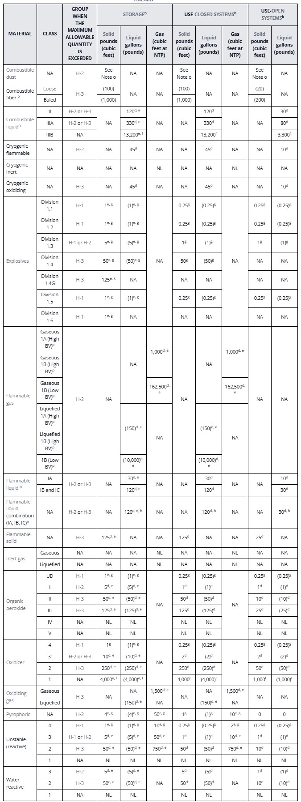

# US CODE NAVIGATOR - 관리 가이드

> 시스템 관리자 및 데이터 담당자를 위한 아키텍처, 데이터 구조, 유지보수 안내

---

## 1. 시스템 아키텍처

### 서버리스 구조 (Single HTML + JSON)

- `index.html` 1개 파일 (약 7,600줄)에 HTML + CSS + JavaScript 모두 포함
- 데이터는 `data/` 폴더의 **9개 JSON 파일**에서 `fetch()`로 로드
- 이미지는 `image/` 폴더의 **266개 JPG 파일**을 직접 참조
- 백엔드 서버, 데이터베이스 불필요 → GitHub Pages, 사내 파일서버 등에서 바로 호스팅 가능

### 파일 구조

```
us-code-navigator/
├── index.html              ← 단일 HTML 애플리케이션 (7,612줄)
├── data/                   ← JSON 데이터 파일 (9개)
│   ├── Discipline.json          (6건) 공종 분류
│   ├── CodeType.json            (3건) 법규 유형
│   ├── Jurisdiction.json        (3건) 관할 지역
│   ├── ModelCode.json           (24건) 법규 기본 정보
│   ├── ModelCodeVersion.json    (20건) 법규 버전
│   ├── ModelCodeDiscipline.json (24건) 법규↔공종 매핑
│   ├── CodeChapter.json         (73건) 챕터 정보
│   ├── CodeContent.json         (1,712건) 조문 본문
│   └── CodeAttachment.json      (264건) 이미지 메타데이터
├── image/                  ← Figure/Table 이미지 (266개 JPG)
│   ├── IBC_10_1003.3.1_F.jpg
│   ├── NFPA 13_10_10.2.4.2.1_T(a).jpg
│   └── ...
├── GUIDE.md                ← 기능 설명서 (사용자용)
├── PRESENTATION_CONTENT.md ← 관리 가이드 (본 문서)
├── DATA_SCHEMA.md          ← 데이터 스키마 상세
└── reference.txt           ← 참조 문서 (이전 버전 index.html)
```

---

## 2. 기술 스택

| 구분 | 기술 | 설명 |
|------|------|------|
| 프론트엔드 | Vanilla JavaScript | 프레임워크 없이 순수 JS로 구현 |
| 스타일링 | Tailwind CSS (CDN) | 유틸리티 기반 CSS + 커스텀 스타일 |
| 폰트 | Google Fonts (Inter) | 깔끔한 산세리프 UI 폰트 |
| 데이터 | JSON 파일 (9개) | `fetch()` API로 비동기 로딩 |
| 이미지 | JPG 파일 (266개) | 법규 내 Figure/Table 이미지 |
| 데이터 변환 | Python (Excel → JSON) | Excel 원본을 JSON으로 자동 변환 |
| 호스팅 | 정적 파일 | 서버 불필요, 어디서든 호스팅 가능 |

### 반응형 디자인

Tailwind CSS 기반으로 4단계 반응형 미디어 쿼리를 적용합니다.

| 브레이크포인트 | 대상 화면 | 주요 조정 |
|---------------|----------|----------|
| 1280px+ (XL) | 일반 데스크톱 | 기본 확대, 사이드바 텍스트 1rem |
| 1536px+ (2XL) | 대형 모니터 | 중간 확대, 책 아이템 150px |
| 1920px+ (3XL) | 30" 모니터 | 대형 확대, 콘텐츠 패딩 증가 |
| 2560px+ (4XL) | 울트라와이드 | 최대 확대, 메인 영역 max-width 제한 |

---

## 3. index.html 내부 구조

### HTML 레이아웃

```
┌──────────────────────────────────────────────────────────────┐
│ <body>                                                       │
│ ┌──────────┐ ┌──────────────────────────────────────────────┐│
│ │ <aside>  │ │ <main>                                       ││
│ │ 사이드바  │ │ ┌──────────────────────────────────────────┐ ││
│ │ (w-64)   │ │ │ <header> 상단 검색바 (sticky, h-20)      │ ││
│ │          │ │ └──────────────────────────────────────────┘ ││
│ │ • 홈     │ │                                              ││
│ │ • 라이브러│ │ ┌──────────────────────────────────────────┐ ││
│ │   리     │ │ │ #homeSection     — 홈(책장 UI)            │ ││
│ │   └ IBC  │ │ │ #librarySection  — 법규 열람              │ ││
│ │   └ NFPA │ │ │ #searchSection   — 고급 검색              │ ││
│ │   └ ...  │ │ │ #compareSection  — 코드 비교              │ ││
│ │ • 고급검색│ │ │ (한 번에 하나만 .active로 표시)            │ ││
│ │ • 코드비교│ │ └──────────────────────────────────────────┘ ││
│ └──────────┘ └──────────────────────────────────────────────┘│
└──────────────────────────────────────────────────────────────┘
```

### 4개 주요 섹션 (section-content 토글)

| 섹션 | ID | 설명 |
|------|----|------|
| 홈 | `#homeSection` | 북셸프 UI, Disclaimer, 법규 카드 목록 |
| 라이브러리 | `#librarySection` | 챕터 사이드바 + 조문 콘텐츠 연속 스크롤 |
| 고급 검색 | `#searchSection` | 키워드 + 필터 기반 상세 검색 |
| 코드 비교 | `#compareSection` | 두 법규 버전 좌우 비교 |

### JavaScript 핵심 로직

#### 데이터 로딩 (DOMContentLoaded)
```javascript
// 9개 JSON 파일을 Promise.all로 병렬 로딩
loadAppData() → fetch('data/*.json') × 9 → appData 객체에 저장
             → mapChapterIDsToContent()  // ChapterID 매핑
             → initAdvancedSearchFilters() // 검색 필터 초기화
```

#### 법규 열람 함수 체인
```
사용자가 사이드바에서 법규 클릭
  → loadCodeFromSidebar(versionId, codeId)
    → showSection('library')           // 라이브러리 섹션 표시
    → loadChapters(versionId, codeId)  // 챕터 목록 생성
      → getChapters(versionId)         // CodeChapter 필터링
      → loadAllChaptersContent()       // 전체 챕터 연속 로드
        → getContents(chapterId)       // CodeContent 필터링
        → buildContentViewModel()      // ViewModel 변환
        → getAttachmentsByIds()        // 첨부파일 조인
        → HTML 생성 & 렌더링
```

#### 이미지 표시 로직
```
CodeContent.AttachmentID ("D001;D002")
  → split(';')
  → CodeAttachment에서 매칭
  → att.FileName + '.jpg'
  → 
  → onerror: .jpg → .JPG → 폴백 아이콘
  → 클릭: openAttachmentModal() → 모달 팝업 확대
```

---

## 4. 데이터 구조

> 필드 수준의 상세 스키마는 `DATA_SCHEMA.md`를 참조하세요.

### 전체 ERD

```
┌─────────────────┐       ┌─────────────────────┐       ┌─────────────────────┐
│   Discipline    │       │      CodeType       │       │    Jurisdiction     │
│ (공종/분야 분류) │       │ (법규 유형 분류)     │       │ (관할 지역)          │
├─────────────────┤       ├─────────────────────┤       ├─────────────────────┤
│ DisciplineID(PK)│       │ CodeTypeID(PK)      │       │ JurisdictionID(PK)  │
│ DisciplineNameEN│       │ CodeTypeName        │       │ JurisdictionName    │
│ DisciplineNameKR│       │ Description         │       │ StateName           │
└────────┬────────┘       └──────────┬──────────┘       │ StateCode           │
         │                           │                  └─────────────────────┘
         │ N:N                       │ 1:N
         ▼                           ▼
┌─────────────────────┐    ┌─────────────────────┐
│ ModelCodeDiscipline │    │     ModelCode       │
│ (법규↔공종 매핑)     │    │ (법규 기본 정보)     │
├─────────────────────┤    ├─────────────────────┤
│ ModelCodeID(FK)─────┼────│ ModelCodeID(PK)     │
│ DisciplineID(FK)    │    │ CodeTypeID(FK)      │
│ ModelCodeName       │    │ ModelCodeName       │
└─────────────────────┘    │ DescriptionEN       │
                           │ DescriptionKR       │
                           └──────────┬──────────┘
                                      │ 1:N
                                      ▼
                           ┌─────────────────────┐
                           │  ModelCodeVersion   │
                           │ (법규 연도별 버전)    │
                           ├─────────────────────┤
                           │ ModelCodeVersionID  │
                           │      (PK)           │
                           │ ModelCodeID(FK)     │
                           │ Year                │
                           │ Description         │
                           └──────────┬──────────┘
                                      │ 1:N
                    ┌─────────────────┴─────────────────┐
                    ▼                                   ▼
         ┌─────────────────────┐             ┌─────────────────────┐
         │    CodeChapter      │             │   CodeAttachment    │
         │ (챕터/장 정보)       │             │ (Figure/Table 첨부)  │
         ├─────────────────────┤             ├─────────────────────┤
         │ ChapterID(PK)       │             │ AttachmentID(PK)    │
         │ ModelCodeVersionID  │             │ ModelCodeVersionID  │
         │      (FK)           │             │      (FK)           │
         │ Chapter             │             │ Type (T/F)          │
         │ TitleEN / TitleKR   │             │ FileName            │
         │ ChapterComment      │             │ Chapter / Section   │
         └──────────┬──────────┘             │ AttachTitleEN/KR    │
                    │                        │ AttachContentEN/KR  │
                    │ 1:N                    └─────────────────────┘
                    ▼                                  ▲
         ┌─────────────────────┐                      │
         │    CodeContent      │    AttachmentID      │
         │ (조문 본문)          │  (세미콜론 구분 참조) │
         ├─────────────────────┤──────────────────────┘
         │ ChapterID(FK)       │
         │ Subsection          │
         │ OrderKey            │
         │ TitleEN / TitleKR   │
         │ ContentEN/ContentKR │
         │ Comment / Reference │
         │ AttachmentID        │
         │ IndexTags[]         │
         └─────────────────────┘
```

### 파일별 레코드 수

| JSON 파일 | 레코드 수 | 분류 | 설명 |
|-----------|-----------|------|------|
| Discipline.json | 6 | 마스터 | 공종/분야 분류 |
| CodeType.json | 3 | 마스터 | 법규 유형 분류 |
| Jurisdiction.json | 3 | 마스터 | 관할 지역 (주) |
| ModelCode.json | 24 | 마스터 | 법규 기본 정보 |
| ModelCodeVersion.json | 20 | 마스터 | 법규 연도별 버전 |
| ModelCodeDiscipline.json | 24 | 관계 | 법규↔공종 N:N 매핑 |
| CodeChapter.json | 73 | 구조 | 챕터(장) 정보 |
| CodeContent.json | 1,712 | 본문 | 실제 조문 내용 |
| CodeAttachment.json | 264 | 첨부 | Figure/Table 메타데이터 |

### OrderKey 구조 (정렬 핵심)

```
형식: CCCC.SSSS.III
       ↓     ↓    ↓
    챕터  섹션  아이템

예시: 0003.0307.001
      → Chapter 3, Section 307, Item 1

특수 접두사: [F] = 소방, [BE] = 건축기본, [BS] = 건축구조
예시: 0009.[F]0903.001
      → Chapter 9, Section [F]903, Item 1
```

### 이미지 파일명 규칙

```
{법규명}_{챕터}_{섹션.서브섹션}_{유형}({번호}).jpg

┌──────────┐ ┌─┐ ┌───────────┐ ┌─┐ ┌───┐
│ IBC      │_│3│_│307.1.1    │_│T│(│1  │).jpg
└──────────┘ └─┘ └───────────┘ └─┘ └───┘
  법규명     챕터    섹션.서브     유형  번호

유형: T = Table(표), F = Figure(그림)
번호: (1), (2), (a), (b) 등 — 같은 위치에 여러 이미지가 있는 경우
```

### 이미지 참조 흐름

```
CodeContent → AttachmentID ("D001;D002")
                    ↓ split(';')
CodeAttachment → FileName ("IBC_3_307.1.1_T(1)")
                    ↓ + '.jpg'
image/ 폴더 → IBC_3_307.1.1_T(1).jpg
                    ↓

```

### 주요 조인(Join) 관계 코드 참조

```javascript
// 법규 목록 조회: Discipline → ModelCodeDiscipline → ModelCode → ModelCodeVersion
const codes = ModelCodeDiscipline
    .filter(mcd => mcd.DisciplineID === selectedDiscipline)
    .map(mcd => ModelCode.find(mc => mc.ModelCodeID === mcd.ModelCodeID))
    .map(mc => ({
        ...mc,
        versions: ModelCodeVersion.filter(v => v.ModelCodeID === mc.ModelCodeID)
    }));

// 조문 내용 조회: ModelCodeVersion → CodeChapter → CodeContent
const chapters = CodeChapter.filter(ch => ch.ModelCodeVersionID === versionId);
const contents = CodeContent.filter(c => c.ChapterID === chapterId)
    .sort((a, b) => normalizeForSort(a.OrderKey).localeCompare(normalizeForSort(b.OrderKey)));

// 첨부파일 조회: CodeContent.AttachmentID → CodeAttachment (세미콜론 split)
const attachmentIds = content.AttachmentID.split(';');
const attachments = CodeAttachment.filter(a => attachmentIds.includes(a.AttachmentID));
// → att.FileName + '.jpg' → image/ 폴더 참조
```

---

## 5. 데이터 파이프라인 (Excel → JSON)

### 원본 데이터

- 각 법규의 조문, 챕터, 첨부파일 정보를 **Excel 스프레드시트**에 정리
- 영문 원문 + 한글 해석을 컬럼별로 입력

### 변환 프로세스

```
┌──────────────┐     Python 스크립트     ┌──────────────┐     index.html
│  Excel 파일  │ ───────────────────── → │  JSON 파일   │ ───── fetch() ───→ 화면 렌더링
│  (.xlsx)     │   (pandas/openpyxl)    │  (9개)       │
└──────────────┘                        └──────────────┘
```

### 변환 시 처리 사항

- Excel 시트별로 별도 JSON 파일 생성 (CodeContent, CodeChapter, CodeAttachment 등)
- ID 체계 자동 생성 (예: ContentID → "C001", "C002", ...)
- `Index` 필드의 세미콜론 구분 문자열 → `IndexTags` 배열로 파싱
- `SubIndex` 필드 → `SubindexPaths` 배열로 변환
- 숫자/문자 혼재 필드의 타입 정규화 (Subsection: float/string/null)
- 빈 셀은 JSON `null`로 변환

---

## 6. 유지보수 — 데이터 추가/수정

### 새 법규 또는 새 버전 추가 시

#### Step 1: Excel 원본 업데이트
- 기존 Excel 파일에 새 시트/행 추가
- 필드 형식을 기존 데이터와 동일하게 유지

#### Step 2: Python 스크립트로 JSON 변환
```
Excel (.xlsx) → Python (pandas) → JSON 파일 (data/ 폴더)
```
- ID 체계 유지 (MC025, MCV021, CH074, C1713, D265 ...)
- IndexTags 배열 자동 생성

#### Step 3: 마스터 데이터 업데이트

| 추가 대상 | 수정 파일 | 필수 필드 |
|-----------|-----------|-----------|
| 새 법규 | ModelCode.json | ModelCodeID, CodeTypeID, ModelCodeName, DescriptionEN/KR |
| 새 버전 | ModelCodeVersion.json | ModelCodeVersionID, ModelCodeID, Year |
| 법규↔공종 연결 | ModelCodeDiscipline.json | ModelCodeID, DisciplineID |
| 새 챕터 | CodeChapter.json | ChapterID, ModelCodeVersionID, Chapter, TitleEN/KR |
| 새 조문 | CodeContent.json | ChapterID, OrderKey, Subsection, TitleEN/KR, ContentEN/KR |
| 새 이미지 | CodeAttachment.json | AttachmentID, FileName, Type, Chapter, Section |

#### Step 4: 이미지 파일 추가
- `image/` 폴더에 JPG 파일 저장
- 파일명은 CodeAttachment.json의 `FileName` + `.jpg`와 일치해야 함
- 파일명 규칙: `{법규}_{챕터}_{섹션}_{유형}({번호}).jpg`

#### Step 5: index.html 사이드바 업데이트 (선택)
- 새 법규를 사이드바에 추가하려면 `index.html`의 `<nav>` 영역에 `submenu-item` 추가
- 북셸프 UI의 `codeDescriptions` 객체에 법규 설명 추가

### 기존 조문 내용 수정

1. `data/CodeContent.json`에서 해당 `ContentID` 또는 `OrderKey`로 대상 레코드 검색
2. `ContentEN`, `ContentKR`, `TitleEN`, `TitleKR`, `Comment` 등 필드 직접 수정
3. 저장 후 브라우저 새로고침

### 이미지 교체

1. `image/` 폴더에서 기존 파일을 새 파일로 덮어쓰기 (파일명 동일하게 유지)
2. 파일명이 바뀔 경우 `CodeAttachment.json`의 `FileName` 필드도 수정

### 주의사항

- JSON 파일 수정 시 **쉼표, 중괄호, 대괄호** 구문 오류에 주의
- ID 값은 시스템 전체에서 **고유**해야 하며, FK 참조 관계 유지 필수
- OrderKey는 정렬 순서를 결정하므로, 기존 패턴에 맞게 설정

---

## 7. 유지보수 — UI 커스터마이징

### 컬러 팔레트 (현재 테마)

| 용도 | 색상 코드 | 설명 |
|------|-----------|------|
| 사이드바 배경 | `#24305E` | 짙은 남색 |
| 사이드바 호버 | `#374785` | 밝은 남색 |
| 액센트 (하이라이트) | `#A8D0E6` | 하늘색 |
| 강조/경고 | `#F76C6C` | 산호색 |
| 키워드 태그 | `#F8E9A1` | 연한 노랑 |

### CSS 수정 위치

- `<style>` 태그 (index.html 상단 약 1~1650줄) 내 직접 수정
- Tailwind CSS 유틸리티 클래스는 HTML 인라인으로 적용

### 사이드바 법규 목록 수정

- index.html의 `<nav>` → `librarySubmenu` 영역 (약 1680~1760줄)
- `onclick="loadCodeFromSidebar('MCV버전ID', 'MC법규ID')"` 형식
